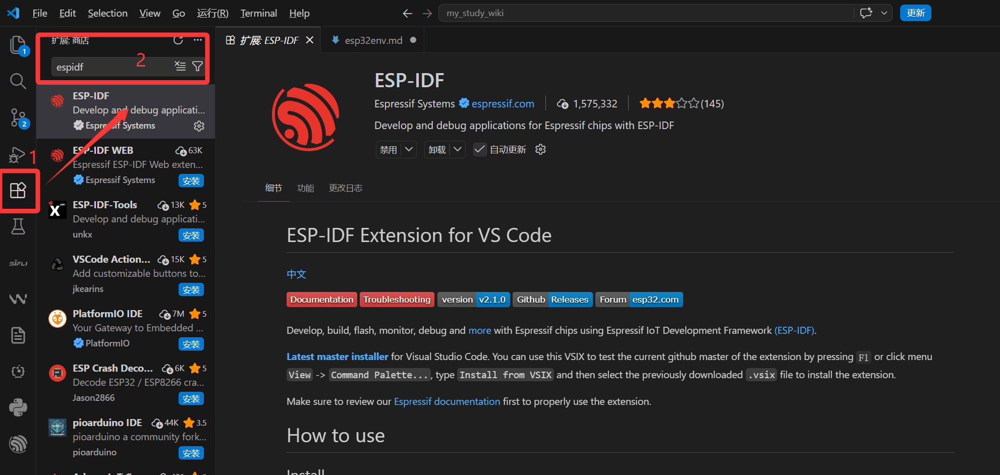
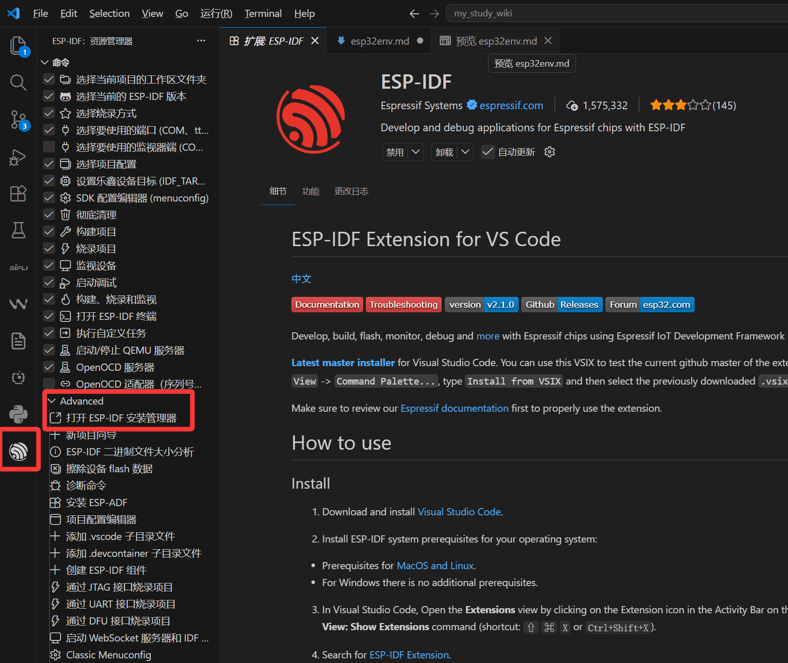
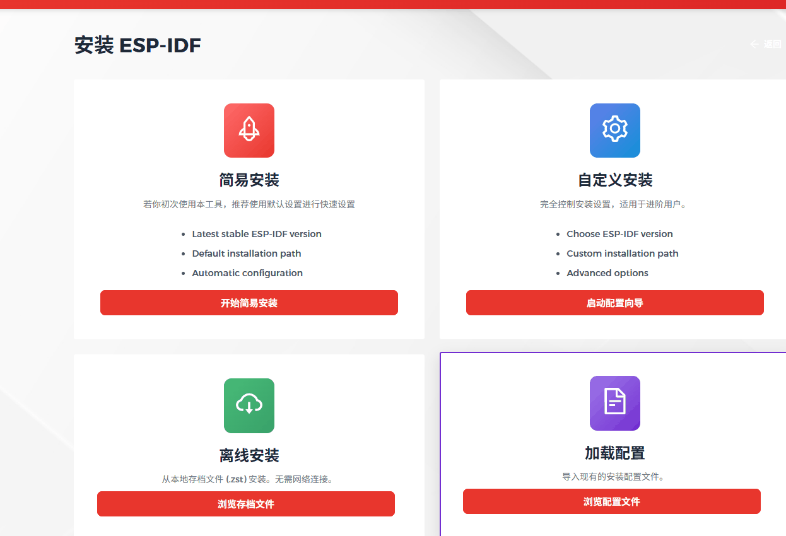
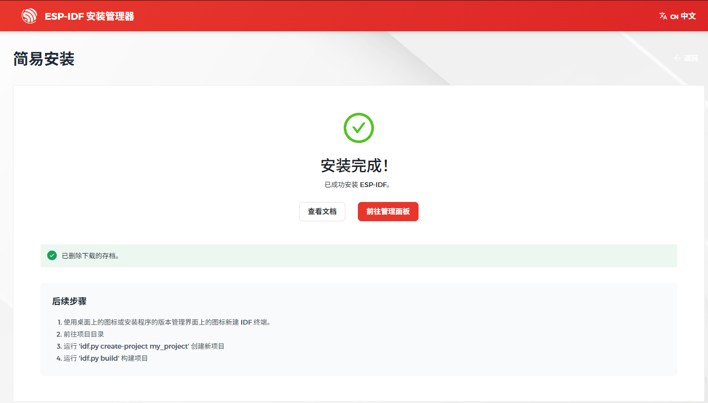
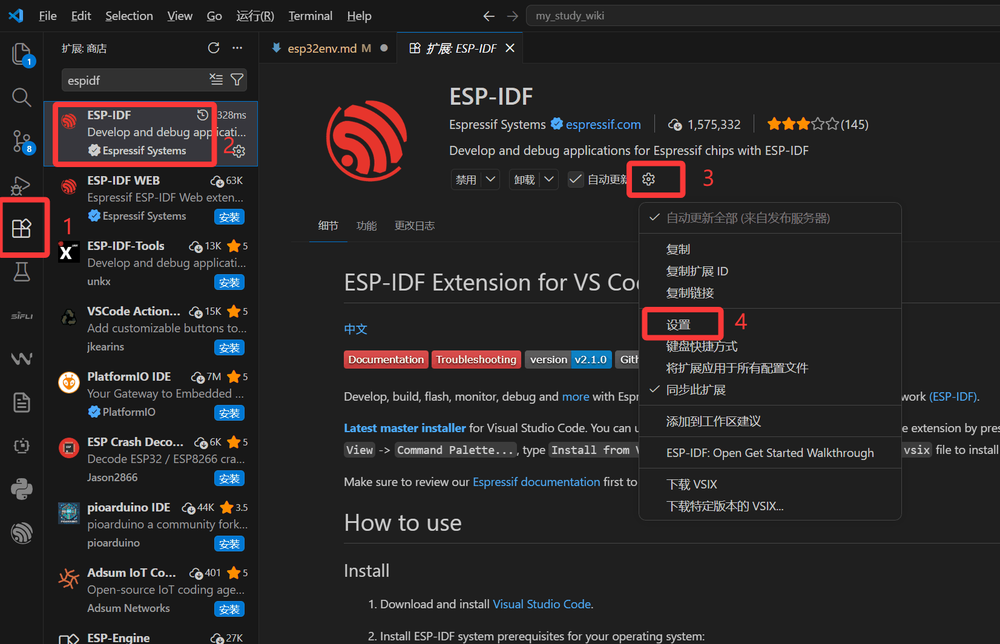
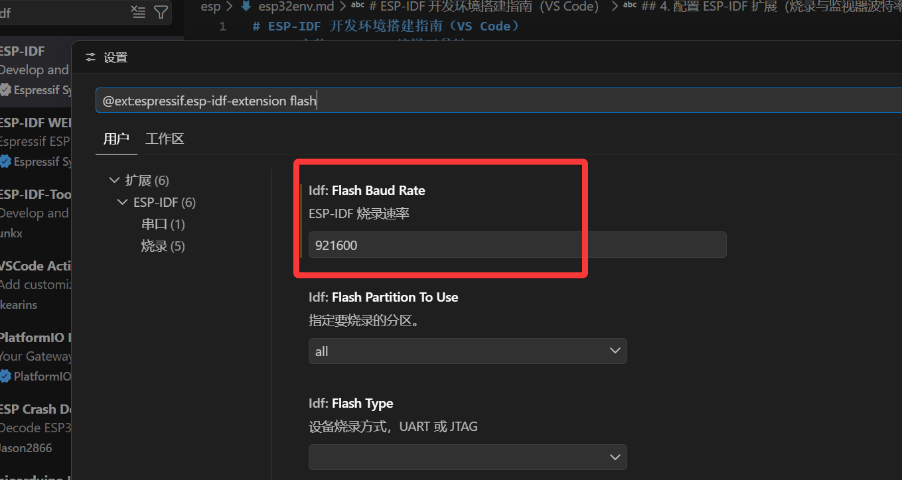
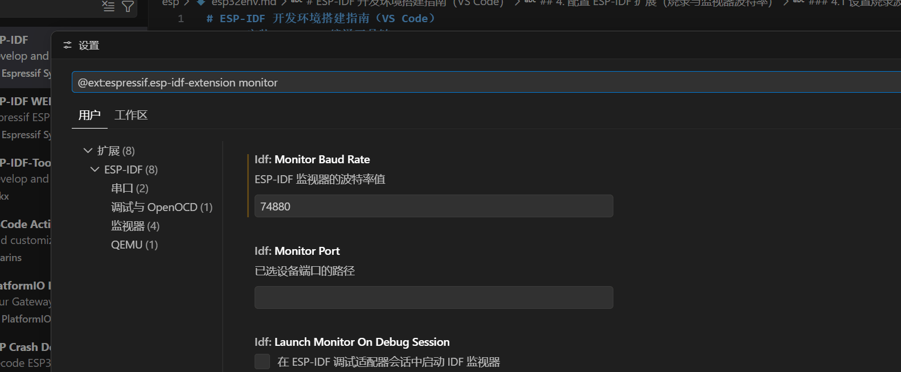

# ESP-IDF 开发环境搭建指南（VS Code）

本文档指导您在 Visual Studio Code 中完成 ESP-IDF 开发环境的安装与基本配置。

---

## 1. 安装 VS Code

- 访问 [Visual Studio Code 官网](https://code.visualstudio.com/download) 下载适配您操作系统的安装包。
- 运行安装程序，按默认选项完成安装。

---

## 2. 安装 ESP-IDF 扩展

1. 启动 VS Code。
2. 点击左侧活动栏中的 **扩展** 图标（由四个方块组成的图标）。
3. 在搜索框中输入 `esp-idf`。
4. 在搜索结果中找到 **Espressif IDF** 扩展，点击 **安装**。

> 📷 *安装界面示意：扩展商店搜索结果页*
* 
---

## 3. 安装 ESP-IDF 编译工具链

1. 点击左侧活动栏中的 **ESP** 图标（Espressif 徽标）。
2. 在打开的视图中，点击 **Advanced**（高级）按钮，进入 **ESP-IDF 安装管理器**。



3. 选择 **简易安装**（Express Installation）模式。
4. 在版本选择下拉框中，选取 **V5.5** 版本。



5. 点击安装，耐心等待所有组件下载和配置完成（过程可能需要较长时间，请保持网络畅通）。

> 📷 *安装管理器界面示意*
* 
---

## 4. 配置 ESP-IDF 扩展（烧录与监视器波特率）

安装完成后，进行两项常用波特率设置：

1. 再次点击左侧 **拓展** 图标，打开esp扩展管理界面。
2. 点击 **设置**（齿轮图标）进入扩展配置页。



### 4.1 设置烧录波特率（Flash Baud Rate）

- 在搜索框中输入 `flash`。
- 找到 **Flash Baud Rate** 选项，将其值修改为 **921600**（推荐值，可提高烧录速度）。

* 
### 4.2 设置串口监视器波特率（Monitor Baud Rate）

- 在搜索框中输入 `monitor`。
- 找到 **Monitor Baud Rate** 选项，将其值修改为 **74880**（ESP8266 / ESP32 默认启动日志波特率）。

* 
---

## 5. 验证安装

- 重启 VS Code 确保所有设置生效。
- 您可以通过命令面板（`Ctrl+Shift+P`）输入 `ESP-IDF: Select Port` 等命令测试环境是否正常。

---

## 注意事项

- 安装工具链时请确保网络稳定，建议关闭代理或防火墙。
- 若遇到权限问题（Linux/macOS），请使用 `sudo` 或以管理员身份运行 VS Code。
- V5.5 为稳定版本，如需其他版本可后续在管理器中切换。

---

至此，您的 ESP-IDF 开发环境已准备就绪，可以开始创建和烧录项目了。
```