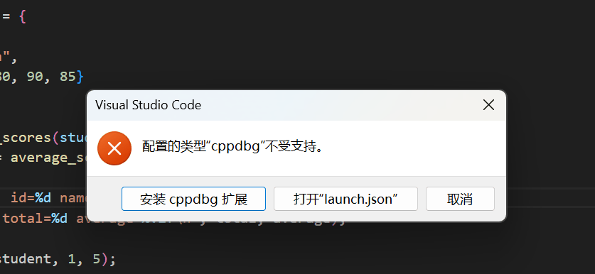
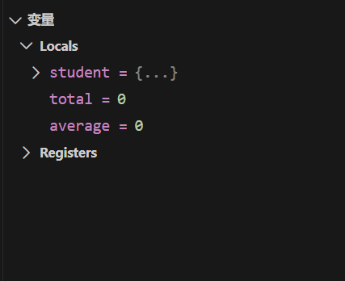
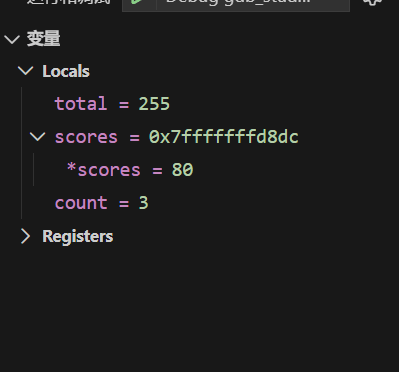
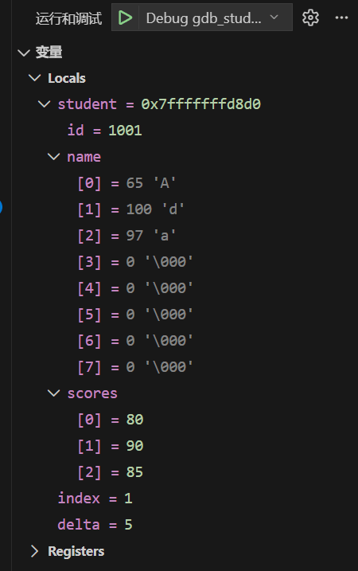
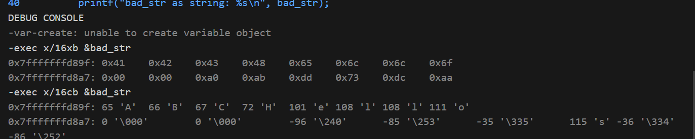
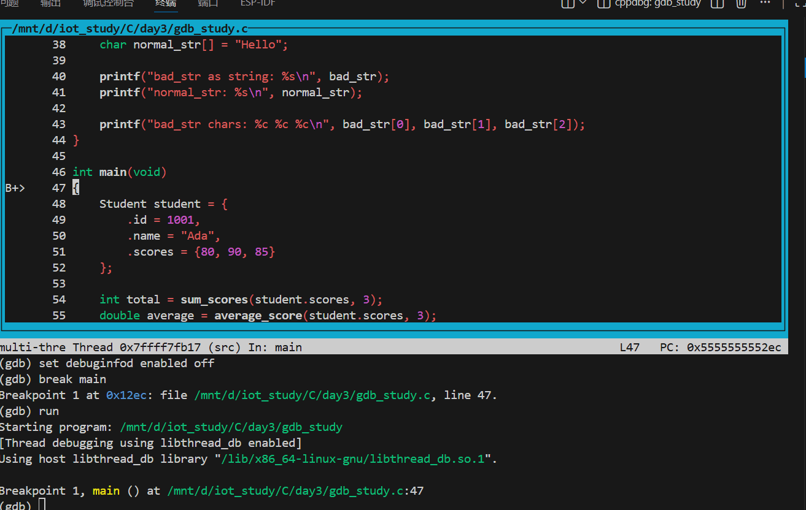

# GDB 调试完整学习流程

这个目录用于学习 C 语言程序的 GDB 调试。建议顺序是：

1. 先用 VSCode C/C++ 插件调试，建立对断点、变量、调用栈、单步执行的直观认识。
2. 再用 WSL 终端操作一遍 GDB，理解调试器真正执行了哪些命令。
3. 最后开启 GDB TUI：`layout src`，把终端变成源码窗口 + 命令窗口。

## 0. 当前文件说明

- `test.c`：你原来的字符串测试程序，核心问题是 `bad_str` 没有 `'\0'` 结尾。
- `gdb_study.c`：新增的系统化调试例子，包含函数调用、循环、结构体、指针、数组、字符串和内存观察。
- `.vscode/tasks.json`：VSCode 编译任务。
- `.vscode/launch.json`：VSCode 调试配置。

重要区别：

- `test.exe` 是 Windows PE 可执行文件，不能直接用 WSL 里的 Linux GDB 调试。
- WSL 里要重新编译出 Linux 可执行文件，例如 `gdb_study` 或 `test`。

### 0.1 `gdb_study.c` 示例源码

这个例子用于练习函数调用、循环、结构体、指针、数组、字符串和内存观察：

```c
#include <stdio.h>

typedef struct {
    int id;
    char name[8];
    int scores[3];
} Student;

int sum_scores(const int *scores, int count)
{
    int total = 0;

    for (int i = 0; i < count; i++) {
        total += scores[i];
    }

    return total;
}

double average_score(const int *scores, int count)
{
    int total = sum_scores(scores, count);
    return (double)total / count;
}

void improve_score(Student *student, int index, int delta)
{
    if (index < 0 || index >= 3) {
        return;
    }

    student->scores[index] += delta;
}

void inspect_strings(void)
{
    char bad_str[3] = {'A', 'B', 'C'};
    char normal_str[] = "Hello";

    printf("bad_str as string: %s\n", bad_str);
    printf("normal_str: %s\n", normal_str);

    printf("bad_str chars: %c %c %c\n", bad_str[0], bad_str[1], bad_str[2]);
}

int main(void)
{
    Student student = {
        .id = 1001,
        .name = "Ada",
        .scores = {80, 90, 85}
    };

    int total = sum_scores(student.scores, 3);
    double average = average_score(student.scores, 3);

    printf("student: id=%d name=%s\n", student.id, student.name);
    printf("before: total=%d average=%.2f\n", total, average);

    improve_score(&student, 1, 5);

    total = sum_scores(student.scores, 3);
    average = average_score(student.scores, 3);

    printf("after: total=%d average=%.2f\n", total, average);

    inspect_strings();

    return 0;
}
```

## 1. 在 WSL 中安装 GDB

在 WSL 终端执行：

```bash
sudo apt update
sudo apt install -y gdb
```

验证：

```bash
gdb --version
```

如果能看到版本号，说明安装成功。

## 2. 用 VSCode 插件调试

### 2.1 推荐打开方式

在 WSL 终端中执行：

```bash
cd /mnt/d/iot_study/C/day3
code .
```

VSCode 左下角应该显示类似 `WSL: Ubuntu`。如果你是直接从 Windows 文件管理器打开目录，VSCode 可能运行在 Windows 模式，此时 `/usr/bin/gdb` 会找不到。

### 2.2 需要的 VSCode 插件

安装这些插件：

- WSL，插件名通常是 `ms-vscode-remote.remote-wsl`
- C/C++，插件名通常是 `ms-vscode.cpptools`

在 WSL 远程窗口里也要安装 C/C++ 插件。VSCode 插件页会显示 `Install in WSL` 或类似按钮。

如果按 `F5` 后看到：

```text
配置的类型 "cppdbg" 不受支持
```

说明当前 VSCode 环境没有安装 C/C++ 调试扩展。处理方式：

1. 点击弹窗里的 `安装 cppdbg 扩展`。
2. 或者打开 Extensions，搜索 `C/C++`，安装 Microsoft 发布的 `ms-vscode.cpptools`。
3. 如果你左下角显示 `WSL: Ubuntu`，要确认插件安装在 WSL 远程环境中，而不只是 Windows 本地环境中。
4. 安装后执行 `Developer: Reload Window`，再按 `F5`。

### 2.3 第一次调试

1. 打开 `gdb_study.c`。
2. 在以下位置点行号左侧添加断点：
   - `main` 函数第一行。
   - `sum_scores` 的 `total += scores[i];`。
   - `improve_score` 的 `student->scores[index] += delta;`。
   - `inspect_strings` 的 `printf("bad_str as string: %s\n", bad_str);`。
3. 按 `F5`，选择 `Debug gdb_study with GDB (WSL)`。

VSCode 会先执行 `.vscode/tasks.json` 中的编译任务：

```bash
gcc -Wall -Wextra -O0 -g gdb_study.c -o gdb_study
```

参数含义：

- `-g`：生成调试信息，没有它就很难看到源码行、变量名和结构体字段。
- `-O0`：关闭优化，让执行顺序更接近你写的源码。
- `-Wall -Wextra`：打开常用警告。

### 2.4 VSCode 调试时重点看哪里

左侧调试栏：

- VARIABLES：当前作用域变量。
- WATCH：手动添加表达式。
- CALL STACK：函数调用栈。
- BREAKPOINTS：断点列表。

顶部按钮：

- Continue：继续运行到下一个断点。
- Step Over：执行当前行，但不进入函数。
- Step Into：进入当前行调用的函数。
- Step Out：运行完当前函数并返回调用者。
- Restart：重新调试。
- Stop：停止调试。

### 2.5 推荐添加的 Watch 表达式

在 WATCH 面板添加：

```c
student
student.scores
student.scores[0]
student.scores[1]
student.scores[2]
&student
total
average
bad_str
normal_str
```

运行到 `inspect_strings` 后，再观察：

```c
bad_str[0]
bad_str[1]
bad_str[2]
```

重点理解：

- `bad_str` 是长度为 3 的字符数组，只能保证有 `'A'`, `'B'`, `'C'`。
- `%s` 打印字符串时会从起始地址一直读，直到遇到 `'\0'`。
- 因为 `bad_str` 没有 `'\0'`，所以 `printf("%s", bad_str)` 可能继续读到旁边的栈内存，这是未定义行为。

### 2.6 在 VSCode Debug Console 执行 GDB 命令

调试暂停时，打开 `DEBUG CONSOLE`，输入：

```text
-exec p student
-exec p &student
-exec p student.scores
-exec x/12dw student.scores
-exec p bad_str
-exec p normal_str
-exec x/16xb &bad_str
-exec x/16cb &bad_str
```

这些命令的含义：

- `p`：print，打印表达式。
- `x`：examine，查看内存。
- `x/16xb`：从某地址开始查看 16 个字节，用十六进制显示。
- `x/16cb`：从某地址开始查看 16 个字符。

## 3. 用 WSL 终端操作 GDB

进入目录：

```bash
cd /mnt/d/iot_study/C/day3
```

编译：

```bash
gcc -Wall -Wextra -O0 -g gdb_study.c -o gdb_study
```

启动 GDB：

```bash
gdb -q ./gdb_study
```

### 3.1 基础流程

在 `(gdb)` 中输入：

```gdb
set debuginfod enabled off
break main
break sum_scores
break improve_score
break inspect_strings
run
```

常用命令：

```gdb
next
step
continue
finish
list
info locals
info args
backtrace
print student
print total
print average
```

含义：

- `break main`：在 `main` 函数入口设置断点。
- `run`：启动程序。
- `next`：单步执行，不进入函数。
- `step`：单步执行，遇到函数会进入函数。
- `continue`：继续运行到下一个断点。
- `finish`：运行完当前函数，回到调用者。
- `list`：显示当前源码附近内容。
- `info locals`：查看当前函数的局部变量。
- `info args`：查看当前函数参数。
- `backtrace`：查看调用栈。
- `print`：打印表达式。

### 3.2 观察循环

运行到 `sum_scores` 后：

```gdb
info args
info locals
print i
print total
print scores[0]
print scores[1]
print scores[2]
next
next
next
```

你要观察的是：

- `i` 如何从 `0` 变化到 `1`、`2`。
- `total` 如何从 `0` 变成 `80`、`170`、`255`。
- 指针 `scores` 虽然只是一个地址，但可以用 `scores[0]` 这种方式读取它指向的数组。

### 3.3 观察结构体和指针

运行到 `improve_score` 后：

```gdb
info args
print student
print *student
print student->scores[1]
next
print student->scores[1]
finish
print student
```

重点理解：

- `student` 是 `Student *` 指针。
- `*student` 是这个指针指向的结构体对象。
- `student->scores[1]` 等价于 `(*student).scores[1]`。
- `finish` 回到 `main` 后，再看 `student.scores[1]`，你会发现它已经从 `90` 变成 `95`。

### 3.4 观察字符串和内存

运行到 `inspect_strings` 后：

```gdb
info locals
print bad_str
print normal_str
x/16xb &bad_str
x/16cb &bad_str
x/16xb &normal_str
x/16cb &normal_str
next
```

重点理解：

- `normal_str` 实际内容是 `'H' 'e' 'l' 'l' 'o' '\0'`。
- `bad_str` 只有 `'A' 'B' 'C'`，没有字符串结束符。
- 当你用 `%s` 打印 `bad_str` 时，C 标准库会继续向后找 `'\0'`。
- 它读到什么、输出什么，不由你保证，所以这叫未定义行为。

## 4. 开启 GDB TUI：layout src

TUI 是 GDB 的文本界面，适合在终端中一边看源码一边执行命令。

启动方式一：

```bash
gdb -tui ./gdb_study
```

启动方式二：

```bash
gdb ./gdb_study
```

进入 GDB 后输入：

```gdb
layout src
```

常用 TUI 命令：

```gdb
layout src
layout asm
layout regs
layout split
focus cmd
focus src
refresh
tui disable
tui enable
```

常用快捷键：

- `Ctrl+x` 然后按 `a`：开启或关闭 TUI。
- `Ctrl+l`：刷新屏幕。
- 方向键：滚动当前焦点窗口。

推荐 TUI 学习流程：

```gdb
break main
run
layout src
next
step
info locals
backtrace
continue
```

如果 TUI 画面乱了，输入：

```gdb
refresh
```

或者按：

```text
Ctrl+l
```

## 5. 调试你原来的 test.c

重新编译：

```bash
gcc -Wall -Wextra -O0 -g test.c -o test
```

启动：

```bash
gdb -q ./test
```

建议命令：

```gdb
set debuginfod enabled off
break main
run
next
print bad_str
print normal_str
x/16xb &bad_str
x/16cb &bad_str
next
next
quit
```

你要抓住的核心：

- `char bad_str[3] = {'A', 'B', 'C'};` 是字符数组，不是合格的 C 字符串。
- C 字符串必须以 `'\0'` 结尾。
- `printf("%s", bad_str)` 需要的是 C 字符串。
- 所以这行代码不是“稳定输出 ABC”，而是一次未定义行为演示。

修复方式：

```c
char good_str[] = {'A', 'B', 'C', '\0'};
```

或者：

```c
char good_str[] = "ABC";
```

## 6. 推荐记忆的 GDB 命令表

```gdb
break main              # 在 main 设置断点
break file.c:12         # 在某文件某行设置断点
info breakpoints        # 查看断点
delete 1                # 删除编号为 1 的断点
disable 1               # 禁用断点
enable 1                # 启用断点
run                     # 启动程序
continue                # 继续运行
next                    # 下一行，不进入函数
step                    # 下一步，进入函数
finish                  # 跑完当前函数并返回
until                   # 跑到循环后的下一行
print expr              # 打印表达式
display expr            # 每次暂停都自动显示表达式
undisplay 1             # 取消自动显示
info locals             # 查看局部变量
info args               # 查看函数参数
backtrace               # 查看调用栈
frame 1                 # 切换调用栈帧
x/16xb addr             # 查看 16 个字节，十六进制
x/16dw addr             # 查看 16 个整数，十进制
x/s addr                # 按字符串查看内存
layout src              # 开启源码 TUI
quit                    # 退出 GDB
```

## 7. 本次实操复盘

### 7.1 VSCode 缺少 cppdbg 扩展

截图位置：



现象：

```text
配置的类型 "cppdbg" 不受支持
```

原因：

- `cppdbg` 是 VSCode C/C++ 插件提供的调试类型。
- GDB 已经安装并不等于 VSCode 可以直接调试。
- VSCode 需要通过 Microsoft C/C++ 插件把图形界面操作转换成 GDB/MI 命令。

处理方式：

1. 安装 `ms-vscode.cpptools`。
2. 如果使用 WSL 远程窗口，要确认插件安装在 WSL 环境中。
3. 重新加载窗口：`Developer: Reload Window`。
4. 再按 `F5` 启动 `Debug gdb_study with GDB (WSL)`。

### 7.2 停在 main 后观察局部变量

截图位置：



你看到过类似：

```text
student = {...}
total = 0
average = 0
```

这一步要理解：

- 调试器显示的是“程序暂停这一刻”的内存状态。
- 如果停在 `main` 函数入口，局部变量的初始化语句可能还没有执行。
- 未初始化变量的值不可靠，不要把它当作程序逻辑结果。

对应源码：

```c
Student student = {
    .id = 1001,
    .name = "Ada",
    .scores = {80, 90, 85}
};
```

执行完这段初始化后，变量才变成：

```text
id = 1001
name = "Ada"
scores = {80, 90, 85}
```

### 7.3 进入 sum_scores 理解数组参数变指针

截图位置：



你看到过类似：

```text
scores = 0x7fffffffd8dc
*scores = 80
count = 3
total = 255
```

对应函数：

```c
int sum_scores(const int *scores, int count)
```

核心理解：

- `scores` 是地址，不是整个数组本体。
- `*scores` 等价于 `scores[0]`。
- `scores[1]` 表示从这个地址往后取第 2 个 `int`。
- 函数通过 `count` 知道应该读几个元素。

在 GDB 中可以这样看：

```gdb
info args
info locals
print scores
print *scores
print scores[0]
print scores[1]
print scores[2]
```

循环过程应该看见：

```text
i = 0, total: 0   -> 80
i = 1, total: 80  -> 170
i = 2, total: 170 -> 255
```

### 7.4 进入 improve_score 理解结构体指针

截图位置：



你看到过类似：

```text
student = 0x7fffffffd8d0
id = 1001
name = {'A', 'd', 'a', '\0', ...}
scores = {80, 90, 85}
index = 1
delta = 5
```

对应函数：

```c
void improve_score(Student *student, int index, int delta)
{
    student->scores[index] += delta;
}
```

核心理解：

- `student` 是 `Student *`，保存的是结构体地址。
- `*student` 是这个地址指向的结构体对象。
- `student->scores[index]` 等价于 `(*student).scores[index]`。
- 因为传入的是 `&student`，所以函数修改的是 `main` 里的原始结构体。

执行这一行前：

```text
student->scores[1] = 90
```

执行这一行后：

```text
student->scores[1] = 95
```

回到 `main` 后重新计算：

```text
total = 260
average = 86.67
```

### 7.5 用 Debug Console 查看字符串内存

截图位置：



在 VSCode 的 `DEBUG CONSOLE` 中输入：

```text
-exec x/16xb &bad_str
-exec x/16cb &bad_str
```

你看到过类似：

```text
0x41 0x42 0x43 0x48 0x65 0x6c 0x6c 0x6f 0x00
  A    B    C    H    e    l    l    o   \0
```

对应源码：

```c
char bad_str[3] = {'A', 'B', 'C'};
char normal_str[] = "Hello";
```

核心理解：

- `bad_str` 只有 `A B C`，没有 `'\0'`。
- `normal_str` 是 `H e l l o \0`。
- 本次运行中，两个数组刚好在栈内存上挨着。
- `%s` 会从给定地址一直读，直到遇到 `'\0'`。

所以：

```c
printf("bad_str as string: %s\n", bad_str);
```

可能输出：

```text
bad_str as string: ABCHello
```

这不是字符串拼接，而是越界读取。严格来说这是未定义行为。

而这行：

```c
printf("bad_str chars: %c %c %c\n", bad_str[0], bad_str[1], bad_str[2]);
```

可以稳定输出：

```text
bad_str chars: A B C
```

因为 `%c` 每次只读一个字符，不需要 `'\0'`。

### 7.6 在终端中开启 layout src

截图位置：



先区分两个提示符：

```text
lichen@Lichen:/mnt/...$    Linux shell，输入 cd、ls、gcc、gdb
(gdb)                      GDB 内部，输入 break、run、next、layout src
```

如果在普通 shell 中输入：

```bash
layout src
```

会报：

```text
Command 'layout' not found
```

正确方式是先进入 GDB：

```bash
cd /mnt/d/iot_study/C/day3
gdb -q ./gdb_study
```

看到 `(gdb)` 后再输入：

```gdb
layout src
set debuginfod enabled off
break main
run
```

或者直接用 TUI 模式启动：

```bash
gdb -tui ./gdb_study
```

TUI 里常见标记：

```text
B    当前行有断点
>    当前程序暂停的位置
B+>  当前行既有断点，也是当前暂停位置
```

## 8. 终端 GDB 常用指令速查

### 8.1 编译与启动

```bash
cd /mnt/d/iot_study/C/day3
gcc -Wall -Wextra -O0 -g gdb_study.c -o gdb_study
gdb -q ./gdb_study
gdb -tui ./gdb_study
```

参数记忆：

```text
-g     生成调试信息
-O0    关闭优化，让源码行和执行顺序更好对应
-Wall  开启常见警告
-Wextra 开启更多警告
-q     安静启动 GDB
-tui   启动 GDB 文本界面
```

### 8.2 断点

```gdb
break main
break sum_scores
break gdb_study.c:54
info breakpoints
disable 1
enable 1
delete 1
clear gdb_study.c:54
```

### 8.3 运行控制

```gdb
run
continue
next
step
finish
until
quit
```

常用判断：

- 想跳过当前函数调用，用 `next`。
- 想进入当前函数调用，用 `step`。
- 想跑完当前函数回到调用者，用 `finish`。
- 想继续运行到下一个断点，用 `continue`。

### 8.4 查看变量、参数、调用栈

```gdb
info locals
info args
backtrace
frame 1
print student
print *student
print student->scores[1]
print scores[0]
ptype student
```

### 8.5 自动显示表达式

```gdb
display i
display total
display scores[i]
info display
undisplay 1
```

`display` 很适合观察循环变量和累加变量。每次程序暂停，GDB 都会自动打印这些表达式。

### 8.6 查看内存

```gdb
x/16xb &bad_str
x/16cb &bad_str
x/12dw student.scores
x/s normal_str
```

格式拆解：

```text
x      examine，查看内存
/16    查看 16 个单位
x      hexadecimal，十六进制
c      character，字符
d      decimal，十进制
b      byte，1 字节
w      word，4 字节
```

所以：

```gdb
x/16xb &bad_str
```

意思是：从 `bad_str` 的地址开始，看 16 个字节，用十六进制显示。

### 8.7 TUI 命令

```gdb
layout src
layout asm
layout regs
layout split
focus src
focus cmd
refresh
tui disable
tui enable
```

快捷键：

```text
Ctrl+x 然后 a    开启或关闭 TUI
Ctrl+l           刷新 TUI 画面
方向键           滚动当前焦点窗口
```

## 9. 建议学习节奏

第一遍：只用 VSCode，看懂按钮和变量变化。

第二遍：用 GDB 命令复现 VSCode 的每一步。

第三遍：用 `layout src`，只看终端源码窗口，不依赖图形界面。

第四遍：调试 `test.c`，用内存命令解释为什么 `bad_str` 的输出不可靠。
