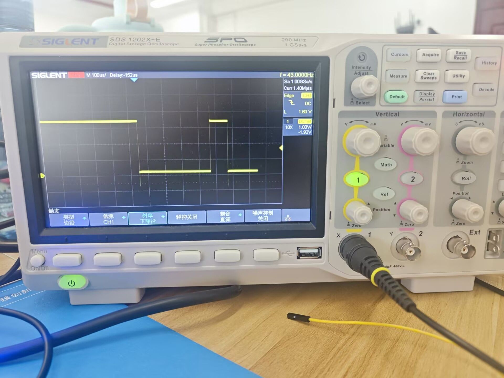
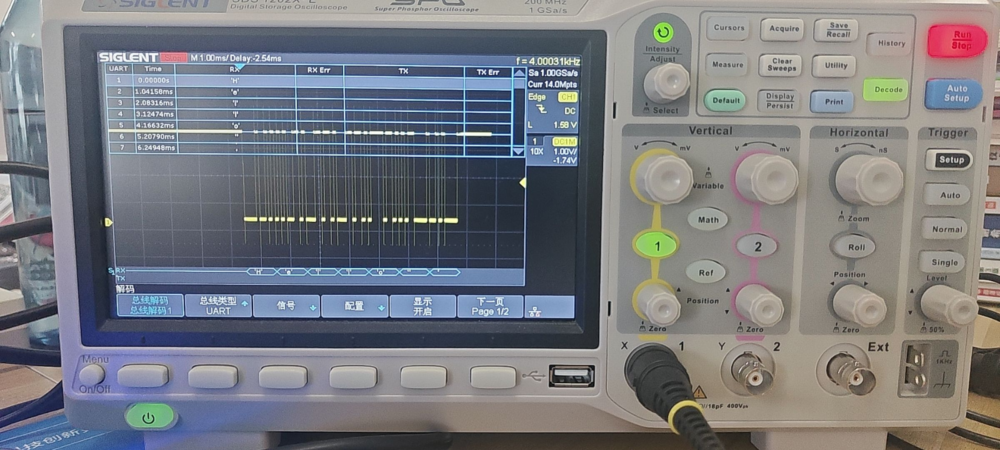
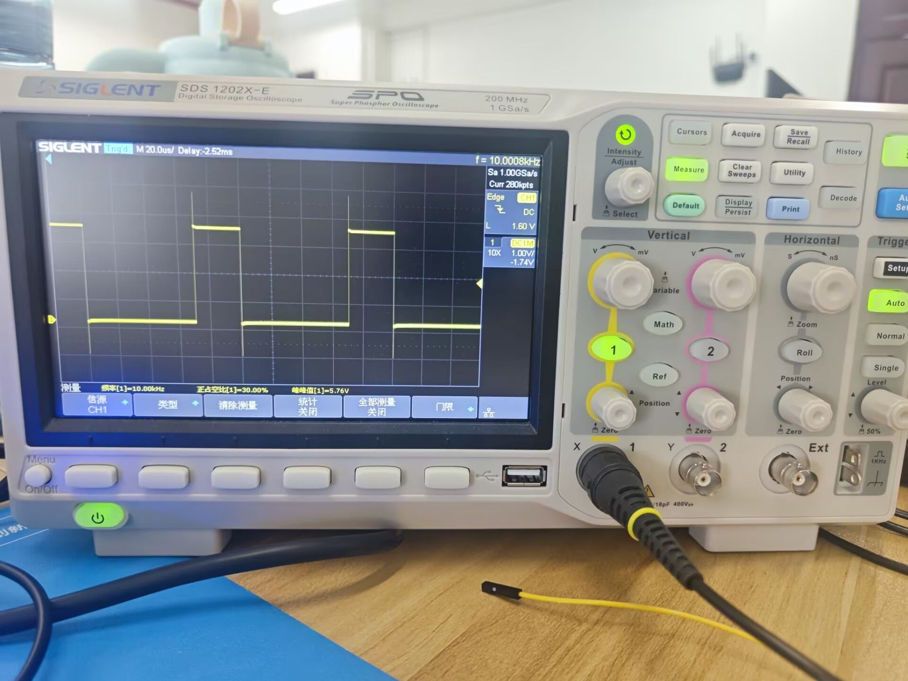
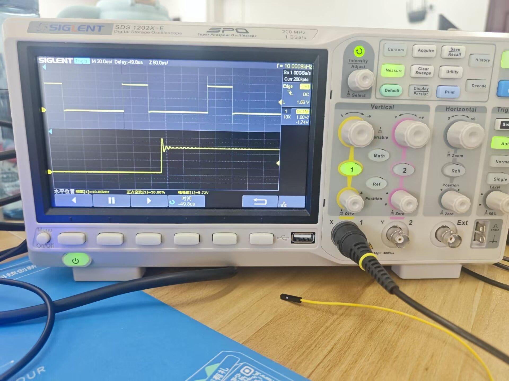
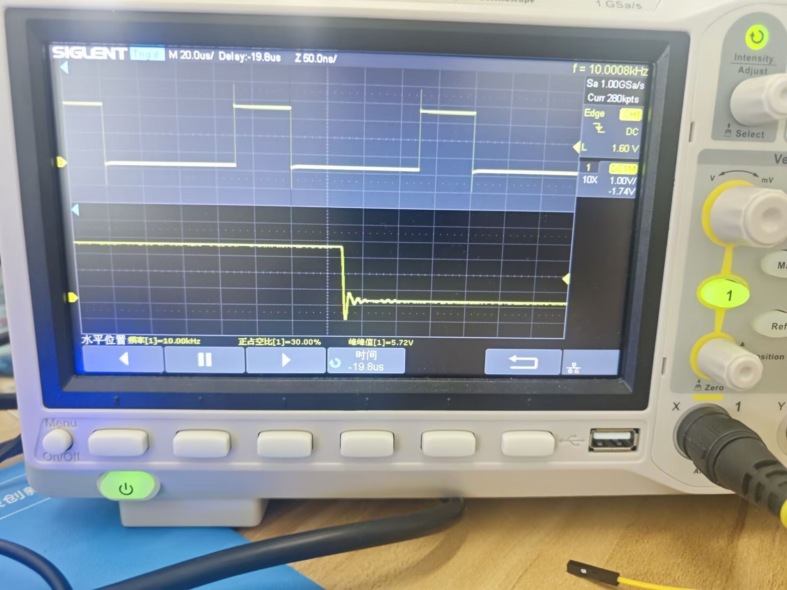
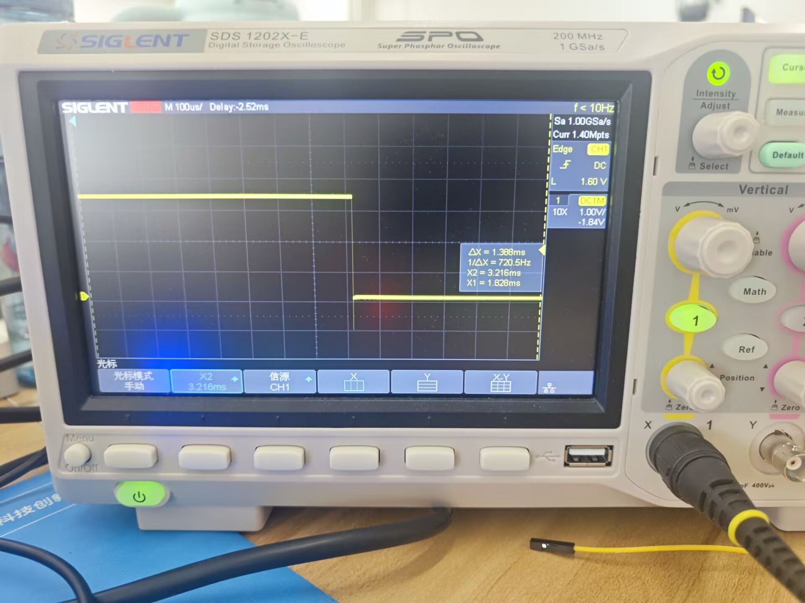
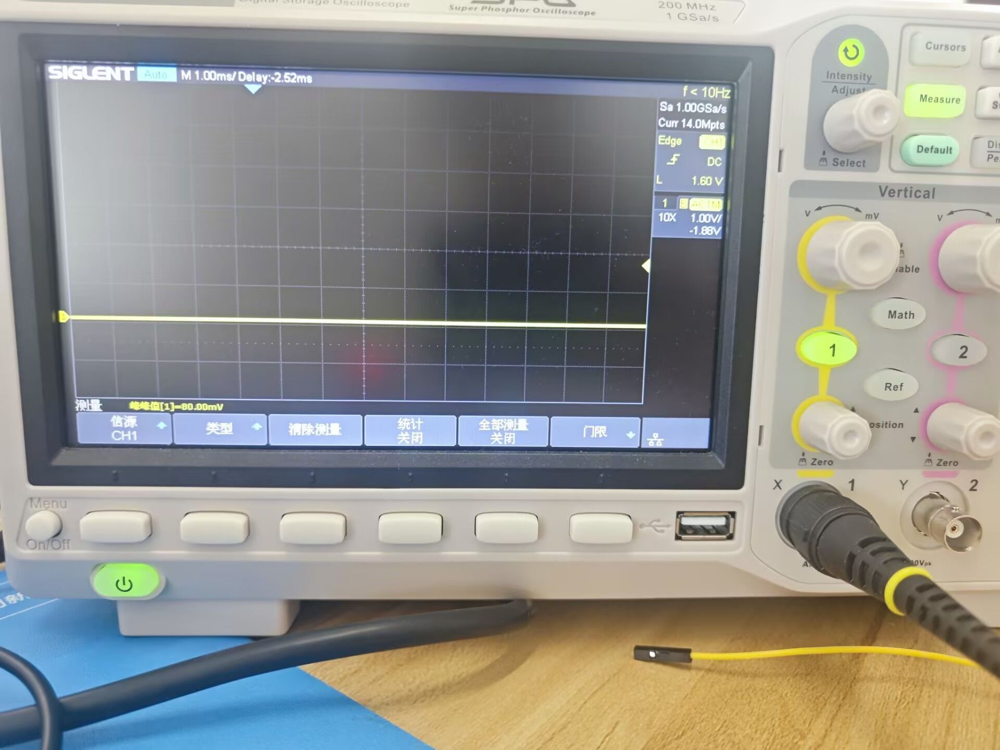

# 示波器（Oscilloscope）基础操作与实战进阶指南

本指南梳理了示波器的核心控制区域、常用按键功能、标准操作流程，并通过 **STM32F103C8T6（C8T6）** 平台设计了四个由浅入深的实战案例，旨在帮助建立从软件代码到物理波形的完整软硬件调试思维。

---

## 一、 示波器与逻辑分析仪的区别

| 特性 | 逻辑分析仪 (Logic Analyzer) | 示波器 (Oscilloscope) |
| :--- | :--- | :--- |
| **测量对象** | 仅数字信号（0 和 1） | 模拟信号 + 数字信号 |
| **关注点** | 协议分析、多通道时序关系 | 电压幅值、波形畸变、噪声、频率细节、信号完整性 |
| **通道数** | 通常较多（8通道、16通道或更多） | 通常较少（2通道或4通道） |
| **电压细节**| 无法显示具体电压数值（只分高低电平） | 能精确测出实时电压与瞬态波形（如 3.12V、-0.5V 冲激） |

---

## 二、 控制面板三大核心区域

示波器的面板看起来复杂，但 90% 的常用操作都集中在以下三个控制区：

```
+-------------------------------------------------------------+
|                                                             |
|   +-----------------------+      [Vertical]    [Horizontal] |
|   |                       |       ( Volts )     (  Time  )  |
|   |                       |        (Pos)         (Pos)      |
|   |        SCREEN         |                                 |
|   |                       |      [Trigger]     [Utility]    |
|   |                       |       (Level)     [Auto][Single]|
|   +-----------------------+                                 |
+-------------------------------------------------------------+
```

### 1. 垂直控制区（Vertical）—— 调整波形的“高矮”
* **`VOLTS/DIV` 旋钮（电压分辨率）**：调整屏幕上垂直方向每格代表的电压值。顺时针旋转波形变高，逆时针旋转波形变矮。
* **`POSITION` 旋钮（垂直位移）**：控制波形在屏幕上的基准线上下移动。
* **`CH1 / CH2` 按键**：打开或关闭对应的物理通道。

### 2. 水平控制区（Horizontal）—— 调整波形的“宽窄”
* **`SEC/DIV` 旋钮（时基 / 时间分辨率）**：调整屏幕上水平方向每格代表的时间值。顺时针旋转时间拉伸（看得更细），逆时针旋转时间压缩。
* **`POSITION` 旋钮（水平位移）**：控制波形左右平移。

### 3. 触发控制区（Trigger）—— 让波形“稳定”不闪烁
* **`LEVEL` 旋钮（触发电平）**：调整触发阈值。在屏幕上表现为一根可以上下移动的虚线。只有当波形的电压穿过这根线时，示波器才会捕获并显示稳定的波形。
* **`50%` 按键**：自动将触发电平设置在波形正中间，快速稳定波形。

---

## 三、 核心按键与特色功能

### 1. `AUTO` (自动设置)
* **作用**：示波器的“一键智能自动配置”。示波器会自动调整垂直分度、时基和触发，将波形调整到屏幕中央。
* *注意*：对于未知信号，可使用 `AUTO` 快速定位。但对于间歇性的数字协议信号，手动调整效果更好，因为 `AUTO` 可能会抓取到无数据期间的空闲平线。

### 2. `SINGLE` (单次触发 / 捕获单次事件)
* **作用**：让示波器进入“等待触发并只捕获一次”的状态。
* **工作逻辑**：
  1. 按下 `Single`，示波器处于等待状态（屏幕左上角显示亮红色的 **`Ready`**）。
  2. 信号线上发生了一次满足触发条件的电平跳变。
  3. 示波器捕获这**唯一一次**的完整过程，并将波形冻结在屏幕上（显示 **`Stop`**），不再继续采集。
* **适用场景**：捕获单次脉冲、开机瞬间电压尖峰（Surge）、非周期性的突发数据包。

### 3. `RUN/STOP` (运行/停止)
* **作用**：暂停或恢复屏幕上波形的实时刷新。`Stop`（红灯）是保留当前屏幕上的最后一帧图像。

### 4. `MEASURE` (测量菜单)
* **作用**：调出自动测量选项，实时显示波形的 **峰峰值（Vpp）**、**最大电压（Vmax）**、**频率（Freq）**、**占空比**等数值。

---

## 四、 示波器基础使用操作流程

```
+----------+      +----------+      +----------+      +----------+      +----------+
| 1.自检校准| ---> | 2.接入信号| ---> | 3.一键自动| ---> | 4.手动微调| ---> | 5.单次捕获|
| (探头1KHz) |      | (信号+GND) |      |  (AUTO)  |      | (V/H旋钮) |      | (Single) |
+----------+      +----------+      +----------+      +----------+      +----------+
```

### 步骤 1：探头补偿与自检（使用前确认）
1. 将示波器探头连接到通道 1（`CH1`）。
2. 将探头物理开关拨到 **`10X`**。
3. 将探头的钩子挂在示波器右下角的 **`1KHz / 3V` 校准信号输出夹**上，探头的接地夹夹在旁边的金属接地片上。
4. 按下 **`AUTO`**。如果显示出边缘平整的方波，说明探头和示波器正常。

### 步骤 2：接入待测信号
1. **接地（共地）**：将探头的黑色接地夹子连接到被测电路板的 **`GND`** 上。
2. **连接测试点**：将探头前端的针尖接触要测量的信号源引脚（如 MCU 引脚）。

### 步骤 3：获取初始波形
* 按下 **`AUTO`** 键，让示波器自动抓取呈现波形。

### 步骤 4：调整至最佳视觉效果
1. 调整 **`VOLTS/DIV`**，使波形占屏幕高度的 1/2 到 2/3 左右。
2. 调整 **`SEC/DIV`**，使屏幕上显示 2 到 5 个完整的波形周期。
3. 利用垂直和水平的 **`POSITION`** 旋钮，将波形细节移到屏幕正中央。

---

## 五、 软硬件实战演练

### 实战案例一：串口协议解码（UART Decoding）
*   **实验目的**：学会捕获间歇性数字总线信号，并使用示波器硬件解码器直观读取传输的字符（ASCII 码）。
*   **硬件连接**：探头接 C8T6 的 **`PA9`**（USART1_TX），接地夹接 **`GND`**。

#### 1. 调试步骤：
1. **通道设置**：物理探头设为 **`10X`**，示波器通道菜单中探头比率也设为 **`10X`**，耦合方式设为 **`DC`**。
2. **垂直/水平设置**：时基设为 **`100us/Div`**（在 9600 波特率下），垂直档位设为 **`1.00V/Div`**。
3. **触发配置**：按下 **`Setup`**，设为 **边沿触发（Edge）**、信源 **`CH1`**、斜率 **`下降沿`（Falling）**。将触发模式设为 **`Normal`**（普通），触发电平调节到 **`1.60V`** 左右。
4. **开启解码（Decode）**：
   * 按下面板上的 **`Decode`** 键。
   * 进入 **`信号配置`（Signals）**：设置 **`RX`** 指向 **`CH1`**，设置 **`TX`** 为 **`无`**。将 `CH1` 的**【阈值】**调整到 **`1.60V`**。
   * 进入 **`总线配置`（Configure）**：波特率设为 **`9600`**，数据位为 **`8`**，校验为 **`无`**，停止位为 **`1`**，空闲电平为 **`高`**。
   * 设置 **`编码格式`（Format）** 为 **`ASCII`**。
5. **捕获波形**：按下 **`Single`** 键，等待单片机发送数据。捕获后，屏幕会自动进入 **`Stop`**。

#### 2. 为什么这样做？
*   **为什么用下降沿触发？**：UART 串口总线在空闲时默认输出高电平（3.3V）。当开始传输数据时，起始位会首先拉低电平。因此，使用**下降沿（Falling）**能精准地将每一次数据包的开头定位在屏幕中央。
*   **为什么只显示了 "H" 字符？**：当水平时基设为 `100us/Div` 时，屏幕总时间只有 $1\text{ms}$。而在 9600 波特率下发送一个字符就需要约 $1.04\text{ms}$。所以整个屏幕只能容纳一个字母 "H" 的宽度。将时基调宽到 **`1.00ms/Div`** 或 **`500us/Div`** 即可在屏幕上看到完整的 "Hello" 序列。

#### 3. 实操图片记录
*   **首次捕获到的串口物理波形（未解码状态）**
    
*   **调整时基后，完美展示出“Hello\r\n”的解码画面**
    

---

### 实战案例二：PWM 测量与信号完整性（PWM & Zoom）
*   **实验目的**：学会使用自动测量功能获取 PWM 特征，并使用双时基（Zoom）功能深入观察数字芯片高速开关状态下的物理缺陷（过冲与振铃）。
*   **硬件连接**：探头接 C8T6 的 **`PA8`**（TIM1_CH1），接地夹接 **`GND`**。

#### 1. 调试步骤：
1. **时基与垂直设置**：时基设为 **`20.0us/Div`**（周期 $100\mu\text{s}$），垂直设为 **`1.00V/Div`**。
2. **添加自动测量（Measure）**：按下 **`Measure`** 键，添加三个参数：**`Freq`（频率）**、**`+Duty`（占空比）**、**`Vpp`（峰峰值）**。
3. **开启 Zoom（时基缩放）**：按下水平控制区的 **`Zoom`** 按键（或按下水平时基 `S/div` 大旋钮）。屏幕分为上下两半。
4. **观察沿细节**：将下方 Zoom 窗口的时基拉细到 **`50.0ns/Div`**，旋转水平位置旋钮，将下方视窗移到波形的**上升沿（或下降沿）**上。

#### 2. 为什么这样做？
*   **为什么波形顶端会有抖动的“波浪”？**：在微观（$50\text{ns}$）下观察，由于芯片翻转极快，杜邦导线的电感与芯片输入电容形成了微小的 **LC 谐振回路**。当电平从 0V 跳变到 3.3V 时，电压由于电学惯性冲过了头（**过冲 - Overshoot**，导致 Vpp 测出 5.7V），随后产生衰减震荡（**振铃 - Ringing**），最后才平息。
*   **下降沿的“扔皮球”现象**：当信号下坠到 0V 时，同样会由于惯性跌入负电压区域（**下冲 - Undershoot**），在零地线上来回反弹跳跃后才静止。
*   *物理类比*：皮球从 3.3 米抛向水泥地面，砸地的一瞬间会发生形变（下冲），然后反弹跳跃数次（振铃），最终静止。

#### 3. 实操图片记录
*   **程序运行后：成功捕获到 10kHz、30% 占空比的完美 PWM 波形**
    
*   **在 50ns 微观视角下，观察到上升沿的过冲与振铃细节**
    
*   **在 50ns 微观视角下，观察到下降沿的下冲与地线反弹细节**
    

---

### 实战案例三：精确测量代码执行时间（Cursors）
*   **实验目的**：学会使用手动光标（Cursors）卡出 GPIO 高电平脉宽，测量出微秒级别的软件代码运行时间。
*   **硬件连接**：探头接 C8T6 的 **`PA1`**，接地夹接 **`GND`**。

#### 1. 调试步骤：
1. **触发设置**：时基设为 **`100us/Div`** 或 **`200us/Div`**（保证能看清脉冲全貌），触发设为 `CH1` 的 **上升沿（Rising）**，触发模式选择 **`Single`**。
2. **捕获脉冲**：给板子通电，示波器检测到上升沿后会自动捕获一次并进入 `Stop`。
3. **开启手动光标（Cursors）**：
   * 按下 **`Cursors`** 键。设置【模式】为 **`手动`（Manual）**，【光标选择】为 **`X`**。
   * 旋转 **万能旋钮** 移动 **光标 X1**，对齐脉冲的**上升沿起点**。
   * **按下万能旋钮一次**切换控制，旋转万能旋钮移动 **光标 X2**，对齐脉冲的**下降沿终点**。
   * 读取屏幕上的 **`△X`（或 `△T`）** 数值。

#### 2. 为什么这样做？
*   **代码耗时的硬件数学推导**：
    *   C8T6 主频为 $72\text{MHz}$（时钟周期约为 $13.88\text{ns}$）。
    *   `for` 循环 10,000 次，由于 `volatile` 防止了优化，每次循环大约需要 10 个时钟周期。
    *   计算得出理论耗时：
        $$\text{Time} = \frac{100,000 \text{ Cycles}}{72,000,000 \text{ Hz}} \approx 1.388 \text{ ms}$$
    *   **实测结果为 `1.388ms`**。示波器完美印证了处理器底层指令的执行耗时。
*   **为什么不用自动测量？**：在复杂的非周期波形中，自动测量的算法常常认错边沿。**手动光标是 100% 由工程师人眼掌控的**，测得的时间最为稳妥可靠。

#### 3. 实操图片记录
*   **使用手动光标定位上升沿和下降沿，测出代码精确运行时间为 1.388ms 的瞬间**
    

---

### 实战案例四：直流电源纹波测量（AC Coupling & BW Limit）
*   **实验目的**：学会排除直流大分量干扰和高频环境噪声，精确测量出单片机 3.3V 直流供电轨上的微小交流纹波。
*   **硬件连接**：探头接 C8T6 板子上的 **`3.3V`** 引脚，接地夹接 **`GND`**。

#### 1. 调试步骤：
1. **更改耦合方式（核心）**：按下 **`CH1`**，将菜单里的【耦合】从 `DC` 切换为 **`AC`（交流耦合）**。此时，原本在屏幕上方的 3.3V 平线会**瞬间自动落回屏幕中心的 0V 刻度线上**。
2. **极度放大垂直灵敏度**：旋转垂直大旋钮（V/div），将垂直档位放大到 **`10.0mV/Div`** 或 **`20.0mV/Div`** 的极小灵敏度档。
3. **限制通道带宽**：在通道菜单中，将 **【带宽限制】（Bandwidth Limit）** 开启为 **`20MHz`**。
4. **测量与读取**：添加自动测量 **`Pk-Pk`（峰峰值）**。屏幕上原本带有尖锐毛刺的“毛毛虫”波形会瞬间变得圆润干净，此时读取纹波的峰峰值。

#### 2. 为什么这样做？
*   **为什么要用 AC 耦合？**：3.3V 的直流偏移量极大。如果使用 DC 耦合，当我们想放大观察毫伏级（mV）的纹波而把电压档调到 10mV/Div 时，3.3V 的大电压会将整个波形推离屏幕上方 330 格远，根本无法看见。AC 耦合通过内部电容**阻断了直流，只放行微小的交流分量**，并将其拉回到屏幕中央以便无限放大。
*   **为什么要限宽 20MHz？**：示波器自带高达 200MHz 的高频带宽，会将空气中的 Wi-Fi、手机基站、日光灯等电磁杂波全部吸入探头。开启 20MHz 限制可以**像筛子一样过滤掉无意义的空气高频噪声**，让我们只专注于电源板本身低频的物理电压波动。

#### 3. 实操图片记录
*   **在 1V/Div 大档位下，电源线呈现为一条毫无噪声细节的“死平线”**
    

---

## 六、 嵌入式研发常用示波器场景总结

1.  **协议与通信联调**：调试 I2C 传感器、SPI 存储器、UART/CAN 接口。观察信号质量，排查总线冲突或阻抗不匹配引起的字符错误（如 ACK 缺失）。
2.  **代码执行与中断诊断**：用 GPIO 翻转法测量中断服务程序（ISR）的进出开销，确保高频控制系统不会发生时序重叠和死机。
3.  **上电 Bring-up（板子初次唤醒）**：
    *   测量各路电源电平爬升斜率。
    *   测量外部晶振（如 8MHz）是否输出稳定的正弦波（**起振测试**）。
4.  **死区时间（Dead Time）测试**：在互补 PWM 控制电机（H桥）时，使用双通道同时测量上、下桥臂驱动，精确确认两者在切换时留有足够的防短路保护间隔。

---

## 七、 工程师必备示波器安全与操作防线（MVK）

### 1. 接地夹安全红线（防止炸板）
*   **机理**：台式示波器的黑色接地夹与市电地线直接相通。
*   **后果**：如果夹到带有电位差的测试点上（例如直接测 220V 电源非隔离侧），会导致严重的**地线短路**，火花四溅并烧毁电路板或示波器。
*   **准则**：测量强电或非隔离系统，必须使用**高压差分探头**，或者让被测板子通过隔离变压器供电。

### 2. 触发三剑客的使用准则
*   不要盲目依赖 `Auto`。
*   **`Normal`**：常态，用于查看循环发送、间歇发出的总线电平。
*   **`Single`**：神技，用于守株待兔式捕获开机上电瞬间、复位引脚跳变、死机前瞬间的单脉冲电平。

---

## 八、 后续待补充学习计划（保持文档可扩展性）
- [ ] **进阶专题一**：如何使用双通道进行 I2C 的 SCL 与 SDA 联合解码调试？
- [ ] **进阶专题二**：多通道测量下，如何避免由于两个探头地线环路引入的共模噪声干扰？
- [ ] **进阶专题三**：如何使用示波器 FFT 频谱分析功能来定位电源板上的高频噪声源？
- [ ] **扩展空白区**：*(欢迎后续在此处追加您在实际工作中的测试笔记、遇到的新波形等内容...)*